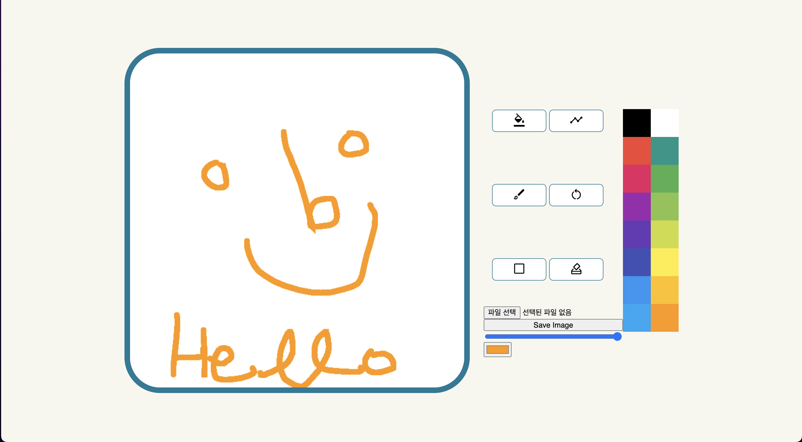

# Drawing Board  
### html, css, javascript로 만든 프로젝트입니다.  
canvas 태그를 이용해 페인트, 그리기, 지우기, 파일 등록 등의 기능을 구현하였습니다.  

   
  

   

## 구현 기능

<li>lineTo(), stroke()를 이용해 paint 기능 구현</li> 

<li>fillRect()를 이용해 fill 기능 구현</li> 

<li>stroke()를 이용해 line 기능 구현</li> 

<li>fillRect()를 이용해 reset 기능 구현</li> 

<li>createObjectURL()를 이용해 파일 추가 기능 구현 </li> 

 

 

## 기술 스택

|    html    |     css    |     javascript   |      figma    |
| :--------: | :--------: | :--------:   |    :--------:   |   
|  ![html]   |   ![css]   |   ![js]  |  ![figma]   |   

 

## 배운 점

<li>canvas 태그의 각 종 메서드를 이용하여 여러 기능을 구현하는 법을 배웠습니다.</li>
<li>canvas.toDataURL, canvas.lineTo, canvas.moveTo, canvas.rect(), canvas.stroke() 등의 메서드 이용</li>

 

<!-- Stack Icon Refernces -->
[html]: /img/stack/html.svg
[css]: /img/stack/css.svg
[figma]: /img/stack/figma.svg
[ts]: /img/stack/typescript.svg
[js]: /img/stack/javascript.svg
[react]: /img/stack/react.svg
[node]: /img/stack/node.svg
